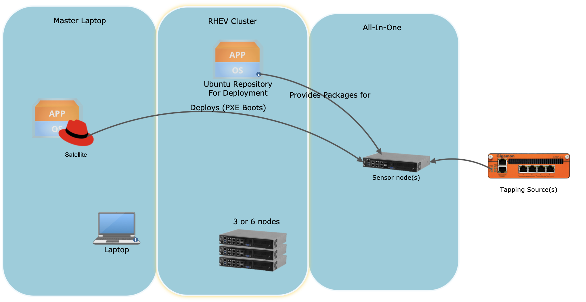
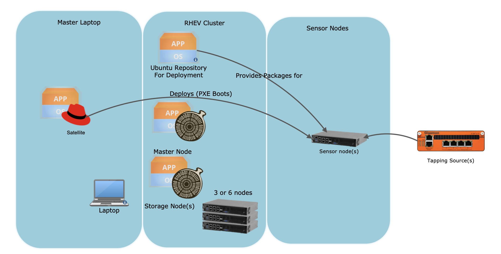

# High Level Guide

This code has been designed to deploy Security Onion from the DDS kits utilizing Project-Cure.  Security Onion is a tool for doing Defensive Cyber Operations which allows operators to scan and find malicious and suspicious traffic.  The main purposes of this are to accommodate the following:

1. Provide a common Security Onion Architecture that is supportable to the DDS kits using existing deployment systems
2. Be deployed in an offline manner at any time, either by the armory or in the field
3. Support a standalone or distributed architecture
4. Packages are able to be updated
5. Security Onion follows the Ubuntu 16.04 STIG
6. System is accredited through RMF

There are two deployment methods for deploying Security Onion that are documented and support, those are Distributed and Standalone.  Those architectures are documented below.

## Architecture: Standalone
Standalone architecture is the simplest.  This architecture deploys all Security Onion components to a single node.  Once deployed the single node may be moved anywhere outside of the DDS architecture and still function as its own independent unit.  This allows the Security Onion sensors to be moved to the kits, deployed and then moved to another location for network tapping.  The node will process, analyze and store traffic local to the node.  Processing more than 2 Gbps of traffic should be avoided with this mode as significant packet loss may occur.

## Architecture: Distributed
Distributed Architecture is more complex and will not function independent of the DDS kit.  In a distributed architecture Sensors are dedicated to packet capture and a separate data storage cluster stores and analyzes all events.  The cluster as a whole is managed by a master node.  In the context of the DDS, the Storage and Master nodes are hosted as Virtual Machines inside of RHEV.  The Sensors are deployed to bare-metal systems.  The benefit to this deployment architecture is it is possible to scale deployments to multiple systems.  Both the storage and sensor nodes can be joined in a cluster and allow for about 3.5 - 4 Gbps per sensor node.  Sensor nodes can be connected to multiple tap points across the network and send all their logs back to a single set of storage allowing analysis across all sensors.  With a load balancer it is possible to cluster multiple of the sensors to scale past capabilities of a single node.

## High Level Process of deployment
Security Onion is designed to be deployed offline.  All the necessary packages and containers are staged at the Armory while the kits are being built.  All contents of this are hosted on a Virtual Machine that is hosted in the RHEV cluster.

< Link to process for Armory >

Both the nodes and the Virtual Machines are deployed through Pre-eXecution Environment.  Nodes are PXE booted from the Satellite deployed inside of the DDS kits.  In standalone deployment only a single node is deployed.  In distributed deployments at least 3 storage, one master and one sensors are deployed.  Once all instances of Security Onion have been deployed to either nodes or virtual machines the SO-SETUP.  Both distributed and standalone processes are documented separately.

< Link to standalone process>

< Link to distributed process >

## Processes for Security

Security Onion has been accredited and therefore certain process must be followed by the CPT teams.

Armory will be responsible for assigning an initial administrator account and assigning it to a CPT member.  This user will be responsible for creating all future accounts of CPT members.  Each account is mapped to an individual user following a first.lastname convention.

<link to procedure here for creating accounts>

At the end of the mission the kits are generally redeployed and therefore it is necessary to backup logs.  This is the responsibility of the CPT administrator.

